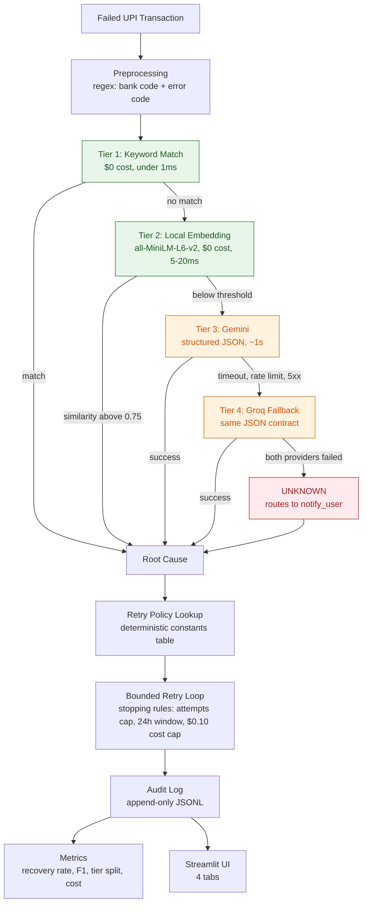
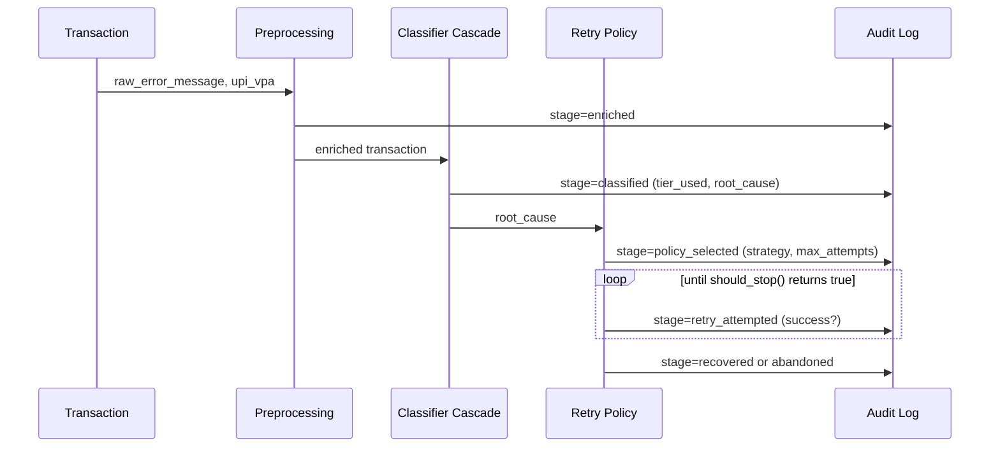

# UPI Payment Failure Recovery Agent

My Track 3 submission for the Razorpay AI Buildathon 2026.

Every failed UPI transaction gets enriched, classified, and run through a
retry policy that actually knows when to stop trying. The interesting part
is the classifier: a 4-tier cascade where the LLM is the last thing tried,
not the first, and every single decision along the way gets written to an
audit log so the recovery numbers below aren't just a vibe.


|  |
|---|---|
| **Track** | Track 3, AI Revenue Recovery |
| **Stack** | Python 3.13, Streamlit, Gemini + Groq, sentence-transformers, pydantic v2 |
| **Data** | 200 synthetic UPI failures, 6 root cause buckets |
| **Storage** | Append-only JSONL, no database |
| **Tests** | 27, `pytest tests/` |

## Contents

- [What this does](#what-this-does)
- [Architecture](#architecture)
- [How a single transaction moves through the system](#how-a-single-transaction-moves-through-the-system)
- [Measured results](#measured-results-on-200-synthetic-transactions)
- [Setup](#setup-under-10-minutes)
- [Repo layout](#repo-layout)
- [Known limitations](#known-limitations)

## What this does

Indian merchants on UPI lose 4-6% of transaction volume to payment
failures, a number NPCI itself publishes. Most merchants deal with this by
retrying blindly on a fixed timer, or not retrying at all. Both quietly
leak money. This agent tries to close that gap properly:

1. Preprocessing enriches every transaction with bank code from UPI VPA
2. 4-tier cascade classifies root cause: keyword match, then local
   embedding, then Gemini, then Groq fallback
3. Deterministic policy selects retry strategy based on cause
4. Bounded retry loop respects stopping rules (max attempts, cost cap,
   time window)
5. Every decision logged to append-only JSONL audit trail
6. Metrics dashboard shows recovery rate, classification accuracy, cost
   per recovery, tier routing distribution

## Architecture

The whole design bet here is that AI should be the last resort, not the
first tool you reach for. Green below is deterministic and free, orange
means an LLM actually got called, and red is what happens when both LLM
providers fail at the same time.



Measured on the current batch: keyword handled 76.5% of traffic, embedding
13.5%, and Gemini plus Groq combined the remaining 10%. Full writeup,
including why that is not the 60/25/15 split originally targeted, in
[docs/ARCHITECTURE.md](docs/ARCHITECTURE.md).

## How a single transaction moves through the system

Every arrow below is a real line written to `logs/audit.jsonl`, not just
something that happened in memory and got forgotten. This is the audit
trail the Track 3 bar asks for.



## Measured results on 200 synthetic transactions

| Metric | Value |
|---|---|
| Overall recovery rate | 71.0% |
| Classification macro-F1 | 0.959 |
| Tier distribution (keyword / embedding / LLM) | 76.5% / 13.5% / 10% |
| Cost per batch (LLM API) | $0.00 (all 10% of LLM-tier traffic landed on Groq's free tier this run, see below) |
| Groq fallback rate | 100% of LLM-tier calls this run |
| Avg batch time | 11-23 seconds for all 200 transactions |

The 100% Groq fallback rate is not a bug, Gemini failed on every LLM-tier
call in every full batch run so far despite working fine in isolated single
calls, most likely a free-tier quota ceiling on the key used tonight. Full
detail in [docs/FAILURE_LOG.md](docs/FAILURE_LOG.md), Failure 4. The tier
split (76.5/13.5/10) is also not the 60/25/15 originally targeted, the
synthetic data ended up easier for the deterministic tiers than planned.
Both numbers are what actually happened, not what was targeted, per this
project's own rule that measured claims have to be measured.

Full breakdown in [docs/ARCHITECTURE.md](docs/ARCHITECTURE.md).

## Setup 

Prerequisites: Python 3.12+ and git. Nothing else to install, no Docker,
no database.

    git clone https://github.com/SpitFiyah/upi-payment-recovery-agent.git
    cd upi-payment-recovery-agent
    python -m venv .venv
    .venv\Scripts\activate
    pip install -r requirements.txt
    copy .env.example .env
    python -m src.data_generator
    streamlit run app.py

Then click "Run Batch" inside the app to populate the audit log and metrics.

Free API keys:
- Gemini: https://aistudio.google.com
- Groq: https://console.groq.com

## Repo layout

```
app.py                  Streamlit UI, the entire frontend and backend
src/
  models.py             pydantic schemas: Transaction, RootCause, RetryPolicy, AuditEntry
  data_generator.py      writes data/synthetic_transactions.json
  preprocessing.py        regex enrichment (bank code, error code)
  tier_keyword.py          Tier 1
  tier_embedding.py        Tier 2
  llm_client.py             Tier 3 (Gemini) + Tier 4 (Groq)
  classifier.py              chains all 4 tiers
  retry_policy.py             constants table + stopping rules
  recovery_agent.py             async batch orchestrator
  audit_log.py                   append-only JSONL
  metrics.py                      recovery rate, F1, cost, tier distribution
tests/                    27 tests, one file per module above
docs/                     ARCHITECTURE.md, DECISIONS.md, FAILURE_LOG.md, ROADMAP.md
```

## Known limitations

See [docs/FAILURE_LOG.md](docs/FAILURE_LOG.md).

## License

MIT
